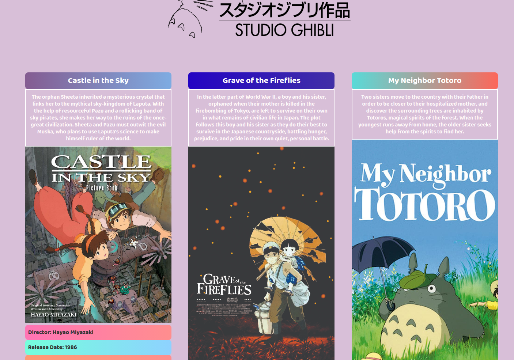

</img>

<h1 align="center">Studio Ghibli Films</h1>
<p align="center">React | Node | Typescript</p>

# Sobre o projeto

Projeto simples, feito para ter um "hands-on" com a stack mencionada.
API consumida: https://ghibliapi.herokuapp.com/films.

Eu fiz um outro projeto consumindo a API, que também está disponível nos meus repositórios, mas dessa vez, coloquei os filmes num banco de dados, e retorno as imagens referentes à cada filme.

Estou usando o template typescript do Node e do React. Para maiores informações, acesse a documentação do <a href="https://www.typescriptlang.org/docs/home.html">Typescript</a>

Também tô usando <a href="http://knexjs.org/">Knex</a>, por motivos didáticos.

# Instalação

Dentro de cada pasta principal ( ghibli / Node REST ) digite ```` npm install / yarn install ```` para instalar as dependências.

Rode o servidor com ```` yarn dev / npm run dev ````.

Rode o React com ```` yarn start / npm start ````.